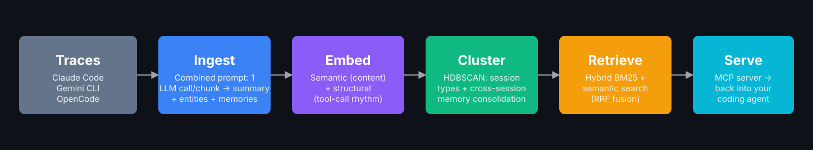
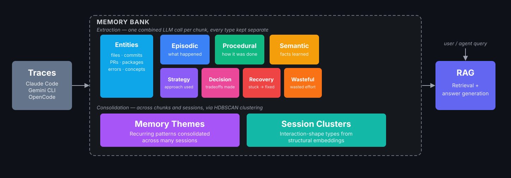

# Agent Trace Signals

Memory analytics layer for coding agent sessions. Ingests traces from Claude Code (`~/.claude/projects/`), Gemini CLI (`~/.gemini/tmp/`), and Opencode (`~/.local/share/opencode/opencode.db`), extracts entities and memories, stores everything in a local SQLite database with vector embeddings, and serves memories back to Claude Code via MCP. Runs entirely offline via Ollama.

## Demo

[](https://youtu.be/qE-sChbI6hw)

## Architecture



Every extraction output is kept as a distinct, separately-typed row (not collapsed into a single blob) and consolidated into cross-session structure before it's ever retrieved:



## Prerequisites

- Python 3.11+
- [uv](https://docs.astral.sh/uv/getting-started/installation/) (package manager)
- [Ollama](https://ollama.com/download) (local LLM inference)

## Get started

```bash
git clone https://github.com/LanGuo/agent-trace-signals.git
cd agent-trace-signals

# Install dependencies
uv sync
uv pip install -e '.[ner]'   # GLiNER NER model (~400 MB, downloaded on first use)

# Pull required Ollama models
ollama pull gemma4:e4b         # combined per-chunk extraction (summary + entities + memories + patterns)
ollama pull gemma3:12b         # session summaries, explicit memory extraction
ollama pull nomic-embed-text   # embeddings (ats embed + ats recall/chunk-search)

# Start Ollama (if not already running)
ollama serve &
```

## Web UI

```bash
uv pip install -e '.[ui]'   # one-time: adds streamlit + plotly
uv run ats ui               # opens http://localhost:8501
```

Five pages:

| Page | What it shows |
|---|---|
| **Home / Sessions** | Sessions table — click a row to drive session detail below. Metrics strip, clickable memory-type breakdown, memories-per-chunk chart. Tabs: Entities, Related Sessions (same workspace / shared file-commit-PR entity / shared cluster-memory pattern — see `session_graph_edges` below), Structural (HDBSCAN session-type cluster + nearest-neighbor sessions by structural embedding). |
| **Query** | `recall` / `chunk-search` / `session-search` with hybrid / semantic / lexical method toggle, memory type filter, session scoping, "Generate Answer" RAG synthesis. |
| **Explore Sessions** | Corpus-wide session EDA (formerly "Agent Compare"/"Explore", now also absorbing "Session Compare") — session scatter with freely selectable x/y metrics, memory/entity-type composition by structural session type, token efficiency timeline, cache hit % distribution, recovery leaderboard, structural embedding UMAP, group summary, and a session connection graph (community detection over `session_graph_edges`, discrete per-community coloring, tunable resolution slider) — groupable by harness, model, permission mode, entrypoint, or structural session type. Bottom section: pick specific sessions for a hand-picked side-by-side comparison (summary scorecards, memory/entity breakdown, token usage, pairwise structural embedding similarity) — this is the old standalone "Session Compare" page, now folded in here. |
| **Explore Memories** | Corpus-wide memory EDA (formerly "Memory Browser", now also absorbing the memory-yield-by-session-type chart) — overview totals, clickable memory-type breakdown, memories-over-time, memory yield per chunk by structural session type, cluster-themes chart, memory-level embedding UMAP colorable by type/cluster-status/harness/workspace, memories-by-workspace. Filterable table (type, method, session, keyword) — click a row for full content, source sessions, and (for `cluster`-type memories) original member breakdown. |
| **Evaluation** | Static results from `experiments/exp10_retrieval_h2h/` — the raw-session-grep vs. design-log-grep vs. ats (MCP) head-to-head on 14 hand-verified facts, precise + fuzzy phrasing, with token/latency cost and a graph-expansion cost/benefit breakdown. |

## Pipeline order

```
ats ingest  →  ats embed  →  ats cluster-sessions  →  ats cluster-memories  →  ats recall / ats serve
               (embeddings)  (HDBSCAN session tags)   (cross-session memory consolidation)
```

| Step | What it does | Needs Ollama? |
|---|---|---|
| `ats ingest` | Parse agent traces (Claude Code JSONL, Gemini CLI JSON/JSONL, Opencode SQLite) → a combined extraction prompt extracts `{summary, entities[], memories[], patterns[]}` per chunk; builds session graph edges — deterministic same-workspace edges (no LLM dependency) plus shared file/commit/PR entity edges | Yes (extraction model) |
| `ats embed` | Embed memories, chunks, entities, and session summaries | Yes (nomic-embed-text) |
| `ats cluster-sessions` | HDBSCAN over structural embeddings → `session_type` tags, then LLM-labels each cluster (interaction shape, not topic) | Yes (labeling step; `--no-label` to skip) |
| `ats cluster-memories` | Embedding-similarity clustering of memory+pattern rows → consolidated `cluster` memories, auto-embedded on mint | Yes (`--model`, default `gemma4:31b`) |
| `ats recall` / `ats serve` | Hybrid BM25 + semantic retrieval over memories and chunks | Yes (nomic-embed-text for query embedding) |

**`ats cluster-sessions` and `ats cluster-memories` are never run automatically — `ats ingest`
does not trigger either one.** Both are safe to rerun anytime (each does a fresh HDBSCAN pass and
fully rewrites `session_type`/cluster memories, not an incremental patch), but if you skip rerunning
them after ingesting a meaningful batch of new sessions, the new sessions sit with `session_type
IS NULL` and no cluster memories reference them — nothing errors, the UI just silently shows
"unlabeled"/empty sections for anything untouched by the last clustering run. Rerun both after any
ingest that adds or meaningfully changes the corpus, not just once at initial setup.

## Usage

```bash
# See what's ingested
uv run ats sessions

# Preview pending files
uv run ats ingest --dry-run

# Step 1: Ingest — combined extraction prompt extracts entities, memories, and patterns per chunk
uv run ats ingest
uv run ats ingest --no-summaries   # skip chunk/session summaries (faster)

# Step 2: Embed everything (memories, chunks, entities, session summaries)
uv run ats embed

# Step 3: Session clustering — HDBSCAN over structural embeddings → session_type tags,
# then LLM-labels each cluster's shared interaction shape (e.g. "Iterative troubleshooting")
uv run ats cluster-sessions
uv run ats cluster-sessions --no-label          # tag only, skip the LLM labeling step

# Step 4: Memory clustering — cross-session consolidation into cluster memories.
# Newly minted cluster memories are embedded automatically at the end (--no-embed to skip
# and embed later by hand instead).
uv run ats cluster-memories
uv run ats cluster-memories --min-cluster-size 3 --min-recurrence 1  # defaults shown
uv run ats cluster-memories --no-embed                               # skip auto-embed of newly minted memories

# Query memories and chunks
uv run ats recall "entity extraction pipeline"
uv run ats recall "error recovery pattern" --memory-type pattern_recovery --top-k 5
uv run ats recall "auth bug" --method semantic        # semantic-only (no BM25)
uv run ats recall "auth bug" --workspace agent-trace-signals   # restrict to one project
uv run ats chunk-search "extraction patterns" --top-k 10
uv run ats chunk-search "auth bug" --session <session-prefix>
uv run ats chunk-search "auth bug" --method lexical   # BM25-only
uv run ats chunk-search "auth bug" --workspace coral-ai         # restrict to one project

# Find relevant sessions by query
uv run ats session-search "Symphony multi-repo orchestration"
uv run ats session-search "coral ai"                       # matches workspace name
uv run ats session-search "PDF download" --method semantic
uv run ats session-search "PDF download" --workspace coral-ai   # restrict to one project

# Find sessions sharing a workspace, structural entities (files/commits/PRs), or a
# consolidated memory pattern (requires ats cluster-memories to have been run), with a given session
uv run ats graph-walk <session-prefix>

# Start the MCP server (see Claude Code integration below)
uv run ats serve

# DB stats
uv run ats stats

# Maintenance: remove orphaned vec0 embedding rows from past re-ingestions
uv run ats clean-orphans
```

## Planned / In Progress

| Area | Status | Notes |
|---|---|---|
| `ats cluster-sessions` | ✅ done | HDBSCAN over structural embeddings → `session_type` tags on sessions. Uses `cluster_selection_method="leaf"` (not the default `"eom"`) — `eom` collapsed most substantial sessions into one giant cluster on this corpus; see `design_decisions.md` 2026-07-13 |
| `ats cluster-memories` | ✅ done | Embedding-similarity clustering of memory+pattern rows → consolidated `cluster` memories. Membership (which original memories fed each cluster) is tracked in `memory_cluster_members`. Also uses `cluster_selection_method="leaf"` — `eom` was collapsing ~98% of memories into one incoherent giant cluster (same failure mode as `cluster-sessions` above, fixed here 2026-07-30 after being missed in the earlier pass); see `design_decisions.md` 2026-07-30 |
| Recall measurement | 🔄 partial | Level 1a eval harness exists; needs annotated ground-truth sessions |
| Raw-trace session embeddings | ✅ done | Stored in `session_structural_embeddings` at ingest; used in UMAP on Compare page |

## Known limitations

- **Clustering is a manual step.** `ats ingest` does not trigger `ats cluster-sessions` or `ats cluster-memories`; rerun both after any ingest that changes the corpus, or `session_type` and cluster memories go stale.
- **Conflict detection has no resolution workflow.** Contradictions between memories in the same cluster are flagged in the `conflicts` table and shown in Explore Memories, but nothing resolves them, `conflict_type` is free text rather than a taxonomy, and memories that never cluster together are never compared. `ModelConfig.conflict_verifier` is reserved for a future re-check pass and currently unused.
- **Retrieval ignores recency.** Ranking does not use memory `status` (open vs. resolved) or age.
- **No in-place schema migration for taxonomy v2.** Older databases must be re-ingested rather than upgraded.
- **Cluster-to-cluster relations** (clusters that share sessions) are not yet exposed as a query.
- **`session_search` is CLI-only**; the MCP server exposes `recall`, `chunk_search`, and `graph_walk`.
- **The `reverted` memory status** has not yet been observed firing on real data.

## Evaluate

```bash
# --- Per-session entity annotation (Level 0 eval) ---
uv run ats annotate-init <session_prefix>    # pre-fill from extracted entities
uv run ats annotate-view <session_prefix>    # HTML span viewer — open in browser
uv run ats eval0 --annotations annotations/ # precision/recall vs annotations (annotations/ is created by you; gitignored)

# --- Cross-session memory annotation (Level 1a eval) ---
uv run ats annotate-memories   # generate HTML viewer, open in browser, save labels
uv run ats eval1a              # structural quality + recall/FPR if annotated

```


## Claude Code integration (MCP)

`ats serve` starts an MCP server on stdio exposing three tools to Claude Code: `recall`,
`chunk_search`, and `graph_walk`.

Register it with the `claude mcp add` CLI (not by hand-editing `settings.json` — recent Claude
Code versions don't read an `mcpServers` key there):

```bash
claude mcp add ats-memory --scope user \
  -e ATS_DB=/path/to/agent-trace-signals/traces.db \
  -- uv run --directory /path/to/agent-trace-signals ats serve
```

`--scope user` registers it once for every project, not just this repo. Verify it connected:

```bash
claude mcp list
```

Then in any Claude Code session:

```
Use the ats-memory recall tool to find memories about entity extraction
```

| MCP tool | What it does |
|---|---|
| `recall(query, memory_type?, top_k=10, include_graph=false, workspace?)` | Hybrid BM25 + semantic search over memories, fused via RRF |
| `chunk_search(query, session_id?, top_k=20, include_graph=false, workspace?)` | Hybrid search over raw conversation chunks |
| `graph_walk(seed_memory_id, depth=2)` | BFS over `session_graph_edges` from a known memory's source sessions |

`include_graph=true` on `recall`/`chunk_search` (and `graph_walk` itself) expands the top hits with graph-connected memories/chunks from other sessions — exploratory cross-session context, not precision retrieval. Measured on the Evaluation page: it never improves fact-lookup hit rate over the base call, even now that both tools are capped (`recall` ≤30 extra memories since 2026-07-30, `chunk_search` ≤66 extra chunks since 2026-08-04) — see `design_decisions.md`'s entries on those two dates for the fan-out bugs this fixed.

### Search methods and scoring

All three CLI search commands (`ats recall`, `ats chunk-search`, `ats session-search`) support `--method hybrid|semantic|lexical`. All methods return **RRF scores** on a consistent 0–0.033 scale regardless of which legs are active — a single-leg method (e.g. `--method lexical`) feeds only that leg into RRF, producing comparable scores.

| Method | BM25 leg | Semantic leg | When to use |
|---|---|---|---|
| `hybrid` (default) | FTS5 porter-stemmed BM25 | vec0 cosine ANN | Best overall after `ats embed` |
| `lexical` | FTS5 only | — | Works without embeddings; good for exact terms |
| `semantic` | — | vec0 only | Intent-based queries after `ats embed` |

**`ats session-search`** lexical leg searches both `session_summary` and `workspace_id` — so `ats session-search "coral ai"` matches the `-Users-you-src-coral-ai` workspace even without embeddings. Semantic leg uses avg-chunk embeddings per session, so it works even for sessions ingested with `--no-summaries`.

**`ats chunk-search`** lexical leg searches both `chunk_text` and `chunk_summary` — raw conversation text plus the LLM-generated summary for each chunk.

**`--workspace`/`-w`** (on `ats recall`, `ats chunk-search`, `ats session-search`, and the `recall`/`chunk_search` MCP tools) restricts results to one project via a substring (`LIKE '%...%'`) match against `workspace_id`, not exact equality — the same real project can be ingested under different `workspace_id` strings depending on the source plugin and code path (e.g. `-Users-you-src-coral-ai` vs. bare `coral-ai`), so an exact match would silently miss some of a project's sessions.

## Project structure

```
src/agent_trace_signals/
  cli.py            # ats CLI entry point
  config.py         # all knobs: ScannerConfig, PipelineConfig, ModelConfig, LightAnalyticsConfig
  models.py         # Pydantic data models
  embedder.py       # Ollama batch embedding with cache
  db/               # SQLite schema + SQLiteStore (sqlite-vec embeddings)
  pipeline/         # IngestionPipeline, ClusteringAnalyticsPipeline, RetrievalEngine
  mcp/              # FastMCP server exposing recall, chunk_search, graph_walk
  annotation/       # HTML viewers for entity and memory annotation
  eval/             # Level 0 and Level 1a evaluation harnesses
  plugins/          # ClaudeCodeSource (JSONL), GeminiSource (JSON/JSONL), OpencodeSource (SQLite)
  providers/        # OllamaProvider, AnthropicProvider
  ui/               # Streamlit app (Query, Explore Sessions, Explore Memories, Evaluation)
design/
  exploration.md          # overarching thesis and system architecture
  design_decisions.md     # chronological evolution of design choices (primary reference)
  deprecated_*.md         # superseded designs, kept for history
experiments/              # experiment scripts + write-ups (raw trace data not included)
notes/                    # research notes (related papers, landscape, early findings)
demo/                     # Remotion source for the demo video
```

## Configuration

All defaults live in `src/agent_trace_signals/config.py`. Edit that file to change any setting — there is no separate config file. Changes take effect on the next run.

### Switching models

Every LLM call goes through a named field in `ModelConfig`. You can change any of them independently:

| Field | Default | Used for |
|---|---|---|
| `entity_extractor_llm` | `gemma4:e4b` | Per-chunk entity extraction (short prompts) and multi-chunk batch verification |
| `chunk_summarizer` | `gemma4:e4b` | Combined per-chunk D-prompt: summary + entities + memories + patterns + preferences in one call. Was `gemma3:12b`; switched after `gemma4:e4b` matched or beat it on memories/patterns/preferences at half the cost of a 2-model split — see `design_decisions.md` 2026-07-22 entry. `d_prompt_max_tokens` (default `4096`) governs its budget, since it's a thinking model. |
| `session_summarizer` | `gemma3:12b` | Session-level summaries during ingest |
| `explicit_memory` | `gemma3:12b` | Explicit memory extraction during ingest |
| `conflict_verifier` | `claude-haiku-4-5-20251001` | Conflict verification in full analytics |
| `embedding_model` | `nomic-embed-text` | All embeddings via `ats embed` and query embedding in `ats recall` |
| `query_answer_model` | `gemma4:e4b` | "Generate Answer" RAG synthesis on the Query page — separate from `chunk_summarizer` so raising answer quality doesn't also slow down ingestion. Was `gemma4:31b`; measured ~7x slower (~79s vs ~11s) on equivalent prompts with no quality improvement, so switched — see `design_decisions.md` 2026-07-14 entry |

**Note:** `ats cluster-memories`'s consolidation LLM call uses its own `--model` CLI flag (default `gemma4:31b`), not a `ModelConfig` field — `cluster_labeler` in config.py is currently unused dead config (a cleanup candidate, along with `Memory.entity_id` and `Memory.action_orientation` — see `design_decisions.md` 2026-07-13 entry).

**gemma4:e4b vs gemma3:12b:** `gemma4:e4b` is a thinking model (Gemma 4 architecture with chain-of-thought reasoning). It is faster than `gemma3:12b` for short prompts due to architectural improvements, but it consumes its generation budget on reasoning tokens before producing output. For short per-chunk extraction prompts this is fine; for longer prompts (e.g. analytics fact-compression with many occurrences) use `gemma3:12b`. The defaults reflect this split.

**Note:** `gemma4:e4b` uses `entity_verifier_max_tokens` (default 2048) rather than the standard 512-token budget. This is because its chain-of-thought reasoning tokens count against `num_predict`, so multi-chunk verification prompts need extra headroom. This does **not** affect KV cache memory — that is controlled solely by `ollama_num_ctx`.

### Ollama memory / performance

| Field | Default | Effect |
|---|---|---|
| `ollama_num_ctx` | `8192` | KV cache token window per call. Ollama's model default is 131072 (~32 GB GPU RAM); 8192 drops that to ~2 GB. Increase to `16384` if you see truncated outputs on very long prompts. |
| `entity_verifier_max_tokens` | `2048` | `num_predict` budget for the multi-chunk entity batch verifier. Needs to be higher than the standard 512 because `gemma4:e4b` spends reasoning tokens before producing output — if it exhausts this budget mid-think, it returns an empty response. Does **not** affect KV cache size. |
| `query_answer_max_tokens` | `2048` | `num_predict` budget for the Query page's answer generation. Same reasoning as `entity_verifier_max_tokens` — `gemma4:e4b` is also a thinking model; 512 was fine for non-thinking `gemma3:12b` but would starve `gemma4:e4b`'s answer text of budget after its reasoning tokens. Confirmed empirically sufficient (non-truncated answers) at 2048. |
| `ollama_base_url` | `http://localhost:11434` | Ollama server URL — change if running Ollama on a different host or port |

### Ingestion

| Field | Default | Effect |
|---|---|---|
| `max_chunk_tokens` | `800` | Target chunk size. Exchanges are greedily packed until this limit; a single exchange that exceeds it alone is split into overlapping sub-chunks. |
| `chunk_overlap_pct` | `0.10` | Character overlap between sub-chunks when splitting an oversized single exchange (10% of the split window size). |
| `occurrence_context_sentences` | `2` | Sentences either side of entity mention captured as context |

### Entity types (combined extraction pipeline)

The default pipeline uses a combined extraction analyzer — one LLM call per chunk extracts summary, entities, memories, and patterns together. Entity types are configurable via `PipelineConfig.d_entity_types` (the `d_` prefix is a naming remnant from early experimentation, not meaningful on its own):

```python
# config.py — PipelineConfig
d_entity_types: dict = {
    "technology": "libraries, tools, CLIs, APIs, languages, platforms, services",
    "framework":  "orchestration and workflow libraries (→ stored as technology)",
    "algorithm":  "specific named algorithms or methods (→ stored as concept)",
    "concept":    "abstractions, patterns, architectural ideas, methodologies",
    "model":      "ML/AI models and model families",
    "dataset":    "named benchmarks, corpora, or datasets",
    "person":     "named individuals",
    "project":    "named repos, products, or systems being built (→ stored as technology)",
}
```

Both the type label **and its description** are sent to the LLM so it classifies consistently. Types are normalized to the shared entity vocabulary (`technology`, `concept`, `model`, `dataset`, `person`, `org`) before storage so D-path and legacy entities use the same type system. Any unrecognized type falls back to `concept`.

To add a domain-specific type (e.g. `"protocol": "communication or data exchange protocols"`): add it to `d_entity_types` and, if it maps to an existing shared type, add an entry to `D_TYPE_NORMALIZATION` in `pipeline/chunk_analyzer.py`.

#### Legacy pipeline entity types (--legacy-pipeline)

When `--legacy-pipeline` is passed, GLiNER is used instead. Entity types are controlled by two separate fields:
- `ner_entity_labels` — natural-language labels sent to GLiNER (e.g. `"software library or framework"`)
- GLiNER maps these to canonical types via `_GLINER_LABEL_TO_TYPE` in `entity_extractor.py`

## Session similarity (embedding distance)

Session-level similarity can be approximated by averaging chunk embeddings per session (requires `ats embed` to have run):

```python
import sqlite3, struct, numpy as np
import sqlite_vec

conn = sqlite3.connect("traces.db")
conn.enable_load_extension(True); sqlite_vec.load(conn); conn.enable_load_extension(False)
cur = conn.cursor()

def decode(blob): return np.array(struct.unpack(f"{len(blob)//4}f", blob))
def cosine(a, b): return float(np.dot(a,b) / (np.linalg.norm(a) * np.linalg.norm(b)))

cur.execute("SELECT r.session_id, re.embedding FROM record_embeddings re JOIN records r ON r.id = re.record_id")
from collections import defaultdict
sess_vecs = defaultdict(list)
for sid, blob in cur.fetchall():
    if blob: sess_vecs[sid].append(decode(blob))
avg_vecs = {sid: np.mean(vs, axis=0) for sid, vs in sess_vecs.items()}

sids = list(avg_vecs)
for i, a in enumerate(sids):
    for b in sids[i+1:]:
        print(f"{a[:8]} vs {b[:8]}: {cosine(avg_vecs[a], avg_vecs[b]):.4f}")
```

**Note:** `session_embeddings` (the per-session embedding stored during `ats embed`) requires `embedding_text` to be populated on the session row — this is only set when `--no-summaries` is NOT used. For sessions ingested with `--no-summaries`, use the chunk-average approach above.

## Session metadata

Per-session metadata is extracted during `ats ingest` and stored in the `session_metadata` table (FK → sessions). Run `ats backfill-metadata` to populate it for sessions ingested before this feature landed. See `design/session_metadata.md` for the full schema.

**Available from Claude Code sessions:**

| Field | Source | Example |
|---|---|---|
| `dominant_model` | `assistant.message.model` | `"claude-sonnet-4-6"` |
| `permission_mode` | `user.permissionMode` | `"bypassPermissions"`, `"default"`, `"plan"` |
| `entrypoint` | `user.entrypoint` | `"sdk-cli"`, `"ide"`, `"cli"` |
| `is_sidechain` | `user.isSidechain` | `true` / `false` |
| `total_input_tokens` | sum of `message.usage.input_tokens` | |
| `total_output_tokens` | sum of `message.usage.output_tokens` | |
| `total_cache_read_tokens` | sum of `message.usage.cache_read_input_tokens` | |
| `duration_ms` | last − first message timestamp | |
| `user_turn_count` | count of `type=user` messages | |
| `git_branch` | `user.gitBranch` | `"main"` |

**Available from Gemini sessions:**

| Field | Source | Example |
|---|---|---|
| `dominant_model` | `gemini.model` | `"gemini-3-flash-preview"` |
| `total_input_tokens` | sum of `tokens.input` | |
| `total_output_tokens` | sum of `tokens.output` | |
| `total_thought_tokens` | sum of `tokens.thoughts` | |
| `duration_ms` | `lastUpdated − startTime` (header) | |

**Available from Opencode sessions:**

| Field | Source | Example |
|---|---|---|
| `dominant_model` | `session.model` JSON field (most common across messages) | `"big-pickle"` |
| `provider_id` | `session.model.providerID` | `"opencode"`, `"anthropic"` |
| `total_input_tokens` | `session.tokens_input` | |
| `total_output_tokens` | `session.tokens_output` | |
| `total_cache_read_tokens` | `session.tokens_cache_read` | |
| `total_cache_creation_tokens` | `session.tokens_cache_write` | |
| `total_thought_tokens` | `session.tokens_reasoning` | |
| `duration_ms` | `session.time_updated − session.time_created` (epoch ms) | |
| `user_turn_count` | count of `role=user` messages | |
| `cwd` | `session.directory` | `/Users/you/src/myproject` |
| `is_sidechain` | `session.parent_id IS NOT NULL` | `true` for sub-sessions |
| `permission_mode` | `session.permission` | |

**Backfilling existing sessions:** Once implemented, run `ats backfill-metadata` (planned) to extract metadata from already-ingested files without re-ingesting. This re-parses source files only — no LLM calls, no changes to records/memories.

